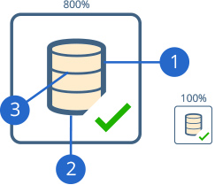
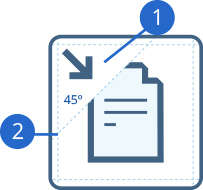
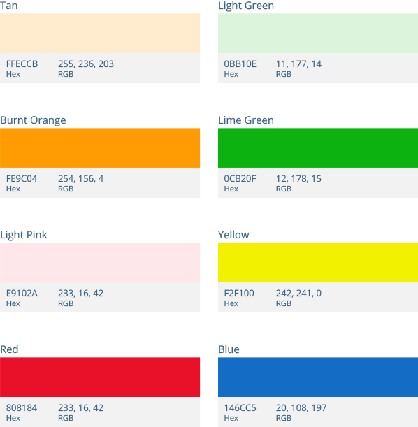

This design guideline is intended to help you maintain consistency with other user interface elements within Pentaho Data Integration. It's recommended that you create your icon in vector shapes using a design tool which saves or exports to Scalable Vector Graphics (SVG) Version 1.1 format. Vector shapes allow assets to be scaled up without loss of detail and crisp edges. The W3C offers a list of programs that support SVG.

## The Anatomy of a PDI Icon

The PDI icons have had a face lift for 5.x. These new icons have been simplified, but continue to emphasize what makes PDI
​a great tool, blending data with ease. This section will review the breakdown of what goes inside these newly designed icons.

1. The primary stroke color is #3D6380
2. The primary stroke is 1.7pt
3. The secondary stroke size is 0.8pt
 	 
## Positioning Action Indicators    
 	 	 
	

1. For any PDI icon which requires an action indicator, the icon must
have the secondary element placed in the top-left or bottom-right
corner of the icon.
2. The primary element within the icon is recommended to have
a 45&deg; angle sliced through, and the secondary element placed
in that spot.

### Action Indicator Badges
Icon | Uses
---- | ----
 | Input / Import / Get / Download / Extract / Read
 | Output / Upload / Export / Insert / Put / Write
 | Validate
 | Create
 | Compare
 | Wait
 | Block
 | Execute / Call
 | Search / Lookup / Exists
 | Bulk Load
 | Encrypt
 | Generator / Processor
 | Delete
 | Decrypt
 | Upsert
 | Update
 | Move
 | Set

### Color Palette

 
## Downloading PDI Icon Template
You can use our SVG template file, (`PDI_Icon_Guide.ai`), as a starting point for creating a PDI icon.  This file is bundled with the other samples in the Pentaho Data Integration SDK.