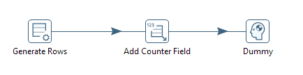
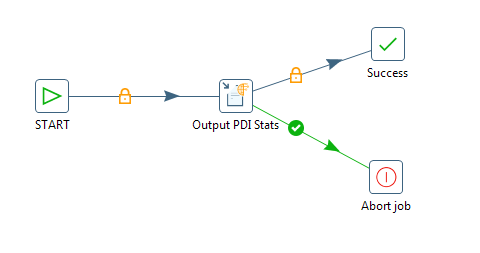

## Embedding Pentaho Data Integration

To integrate PDI transformations and jobs into your applications, embed PDI objects directly into your application code. The instructions in this section address common embedding scenarios.

You can get the accompanying sample project from the kettle-sdk-embedding-samples folder of the sample code package. The sample project is bundled with a minimal set of dependencies. In a real-world implementation, projects require the complete set of PDI dependencies from `data-integration/lib`, and may require plugins from `data-integration/plugins`. Consider the following:

#### PDI Dependencies
All PDI dependencies must be included in the class path. This includes files located within the following PDI folders:
* `data-integration/lib`
* `data-integration/libswt/<os>`
* `data-integration/classes`

You can point to these folders directly within the PDI installation or copy these folders into your project’s directory structure. Examples:

   ```
   java -classpath "lib/*;libswt/linux/*;classes/*" MyApp.java
   ```

   ```
   java -classpath "$PDI_DI_DIR/lib/*;$PDI_DI_DIR/libswt/linux/*;
      $PDI_DI_DIR/classes/*" MyApp.java
   ```

#### OSGI features

In order to use default osgi features of PDI, make the PDI `data-integration/system` folder available to your application - this folder is required for proper karaf initialization. This can be done in the following ways:
* Copy the `data-integration/system` folder directly into the `<working directory>/systems` folder of your application
* Set the `pentaho.user.dir` system property to point to the PDI `data-integration` folder (parent of the system folder), either through a command line option (`-Dpentaho.user.dir=<pdi install path>/data-integration`), or directly within the code:

   ```
   System.setProperty( "pentaho.user.dir", new File("<pdi install path>/
      data-integration") );
   ```

Furthermore, to enable osgi features of PDI that are not enabled by default, the appropriate feature  (jar or kar) needs to be added to the data-integration\system\karaf\deploy folder. No application reboot is required.

#### Legacy Kettle Plugins

Make the kettle plugins (non-osgi) available to your application. Out of the box, the kettle engine will look for plugins in these two locations (recursively):
* `<working directory>plugins`
* `<user.home>/.kettle/plugins`

To make default kettle plugins available, do one of the following:
* Copy the  `<pdi install path>/data-integration/plugins` folder directly into the `<working directory>/systems` folder of your application
* Set the `KETTLE_PLUGIN_BASE_FOLDERS` system property to point to the PDI `data-integration` folder (parent of the plugins folder), either through a command line option (`-DKETTLE_PLUGIN_BASE_FOLDERS=<pdi install path>/data-integration`), or directly within the code:

   ```
   System.setProperty( "KETTLE_PLUGIN_BASE_FOLDERS", new File("<pdi install path>/
      data-integration") );
   ```

Once the plugin location(s) are properly configured, you can place any additional custom plugins in the specified locations. You can also place custom plugins in the location(s) of your choosing, as long at these locations are registered with the appropriate implementation of `PluginTypeInterface` prior to initializing the kettle environment:

   ```
   StepPluginType.getInstance().getPluginFolders().add( new PluginFolder(
      "<path to the plugin folder>" , false, true ) );
   ```

### Sample Code

For each embedding scenario, there is a sample class that can be executed as a stand-alone java application.

* [Running Transformations](#running-transformations)
* [Running Jobs](#running-jobs)
* [Building Transformations Dynamically](#building-transformations-dynamically)
* [Building Jobs Dynamically](#building-jobs-dynamically)
* [Obtaining Logging Information](#obtaining-logging-information)
* [Exposing a Transformation or Job as a Web Service](#exposing-a-transformation-or-job-as-a-web-service)

### Running Transformations

If you want to run a PDI transformation from Java code in a stand-alone application, take a look at this sample class, `org.pentaho.di.sdk.samples.embedding.RunningTransformations`. It sets the parameters and executes the transformation in `etl/parameterized_transformation.ktr`. The transform can be run from the `.ktr` file using `runTransformationFromFileSystem()` or from a PDI repository using `runTransfomrationFromRepository()`.

1. Always make the first call to `KettleEnvironment.init()` whenever you are working with the PDI APIs.
2. Prepare the transformation. The definition of a PDI transformation is represented by a `TransMeta` object. You can load this object from a `.ktr` file, a PDI repository, or you can generate it dynamically. To query the declared parameters of the transformation definition use `listParameters()`, or to query the assigned values use `setParameterValue()`.
3. Execute the transformation. An executable `Trans` object is derived from the `TransMeta` object that is passed to the constructor. The `Trans` object starts and then executes asynchronously. To ensure that all steps of the `Trans` object have completed, call `waitUntilFinished()`.
4. Evaluate the transformation outcome. After the `Trans` object completes, you can access the result using `getResult()`. The `Result` object can be queried for success by evaluating `getNrErrors()`. This method returns zero (0) on success and a non-zero value when there are errors. To get more information, retrieve the transformation log lines.

### Running Jobs

If you want to run a PDI job from Java code in a stand-alone application, take a look at this sample class, `org.pentaho.di.sdk.samples.embedding.RunningJobs`. It sets the parameters and executes the job in `etl/parameterized_job.kjb`. The job can be run from the `.kjb` file using `runJobFromFileSystem()` or from a repository using `runJobFromRepository()`.

1. Always make the first call to `KettleEnvironment.init()` whenever you are working with the PDI APIs.
2. Prepare the job. The definition of a PDI job is represented by a `JobMeta` object. You can load this object from a `.kjb` file, a PDI repository, or you can generate it dynamically. To query the declared parameters of the job definition use `listParameters()`. To set the assigned values use `setParameterValue()`.
3. Execute the job. An executable `Job` object is derived from the `JobMeta` object that is passed in to the constructor. The `Job` object starts, and then executes in a separate thread. To wait for the job to complete, call `waitUntilFinished()`.
4. Evaluate the job outcome. After the `Job` completes, you can access the result using `getResult()`. The `Result` object can be queried for success using `getResult()`. This method returns true on success and false on failure. To get more information, retrieve the job log lines.

### Building Transformations Dynamically

To enable your application to respond quickly to changing conditions, you can build transformations dynamically. The example class, `org.pentaho.di.sdk.samples.embedding.GeneratingTransformations`, shows you how. It generates a transformation definition and saves it to a `.ktr` file.

1. Always make the first call to `KettleEnvironment.init()` whenever you are working with the PDI APIs.
2. Create and configure a transformation definition object. A transformation definition is represented by a `TransMeta` object. Create this object using the default constructor. The transformation definition includes the name, the declared parameters, and the required database connections. 
3. Populate the `TransMeta` object with steps. The data flow of a transformation is defined by steps that are connected by hops.
  1. Create the step by instantiating its class directly and configure it using its get and set methods. Transformation steps reside in sub-packages of `org.pentaho.di.trans.steps`. For example, to use the Get File Names step, create an instance of `org.pentaho.di.trans.steps.getfilenames.GetFileNamesMeta` and use its get and set methods to configure it.
  2. Obtain the step id string. Each PDI step has an id that can be retrieved from the PDI plugin registry. A simple way to retrieve the step id is to call `PluginRegistry.getInstance().getPluginId(StepPluginType.class, theStepMetaObject)`. 
  3. Create an instance of `org.pentaho.di.trans.step.StepMeta`, passing the step id string, the name, and the configured step object to the constructor. An instance of `StepMeta` encapsulates the step properties, as well as controls the placement of the step on the Spoon canvas and connections to hops. Once the `StepMeta` object has been created, call `setDrawn(true)` and `setLocation(x,y)` to make sure the step appears correctly on the Spoon canvas. Finally, add the step to the transformation, by calling `addStep()` on the transformation definition object.
  4. Once steps have been added to the transformation definition, they need to be connected by hops. To create a hop, create an instance of `org.pentaho.di.trans.TransHopMeta`, passing in the From and To steps as arguments to the constructor. Add the hop to the transformation definition by calling `addTransHop()`.

After all steps have been added and connected by hops, the transformation definition object can be serialized to a `.ktr` file by calling `getXML()` and opening it in Spoon for inspection. The sample class `org.pentaho.di.sdk.samples.embedding.GeneratingTransformations` generates this transformation.



### Building Jobs Dynamically

To enable your application to respond quickly to changing conditions, you can build jobs dynamically. The example class, `org.pentaho.di.sdk.samples.embedding.GeneratingJobs`, shows you how. It generates a job definition and saves it to a `.kjb` file.

1. Always make the first call to `KettleEnvironment.init()` whenever you are working with the PDI APIs.
2. Create and configure a job definition object. A job definition is represented by a `JobMeta` object. Create this object using the default constructor. The job definition includes the name, the declared parameters, and the required database connections.
3. Populate the `JobMeta` object with job entries. The control flow of a job is defined by job entries that are connected by hops.
  1. Create the job entry by instantiating its class directly and configure it using its get and set methods. The job entries reside in sub-packages of `org.pentaho.di.job.entries`. For example, use the File Exists job entry, create an instance of `org.pentaho.di.job.entries.fileexists.JobEntryFileExists`, and use `setFilename()` to configure it. The Start job entry is implemented by `org.pentaho.di.job.entries.special.JobEntrySpecial`.
  2. Create an instance of `org.pentaho.di.job.entry.JobEntryCopy` by passing the job entry created in the previous step to the constructor. An instance of `JobEntryCopy` encapsulates the properties of a job entry, as well as controls the placement of the job entry on the Spoon canvas and connections to hops. Once created, call `setDrawn(true)` and `setLocation(x,y)` to make sure the job entry appears correctly on the Spoon canvas. Finally, add the job entry to the job by calling `addJobEntry()` on the job definition object. It is possible to  place the same job entry in several places on the canvas by creating multiple instances of JobEntryCopy and passing in the same job entry instance. 
  3. Once job entries have been added to the job definition, they need to be connected by hops. To create a hop, create an instance of `org.pentaho.di.job.JobHopMeta`, passing in the From and To job entries as arguments to the constructor. Configure the hop consistently. Configure it as a green or red hop by calling `setConditional()` and `setEvaluation(true/false)`. If it is an unconditional hop, call `setUnconditional()`. Add the hop to the job definition by calling `addJobHop()`.

After all job entries have been added and connected by hops, the job definition object can be serialized to a `.kjb` file by calling `getXML()`, and opened in Spoon for inspection. The sample class `org.pentaho.di.sdk.samples.embedding.GeneratingJobs` generates this job.



### Obtaining Logging Information

When you need more information about how transformations and jobs execute, you can view PDI log lines and text.

PDI collects log lines in a central place. The class `org.pentaho.di.core.logging.KettleLogStore` manages all log lines and provides methods for retrieving the log text for specific entities. To retrieve log text or log lines, supply the log channel id generated by PDI during runtime. You can obtain the log channel id by calling `getLogChannelId()`, which is part of `LoggingObjectInterface`. Jobs, transformations, job entries, and transformation steps all implement this interface. 

For example, assuming the job variable is an instance of a running or completed job. This is how you retrieve its log lines:

```
LoggingBuffer appender = KettleLogStore.getAppender();
String logText = appender.getBuffer( job.getLogChannelId(), false ).toString();
```

The main methods in the sample classes `org.pentaho.di.sdk.samples.embedding.RunningJobs` and `org.pentaho.di.sdk.samples.embedding.RunningTransformations` retrieve log information from the executed job or transformation in this manner.

### Exposing a Transformation or Job as a Web Service

Running a [PDI Job](#running-jobs) or [Transformation](#running-transformations) as part of a web-service is implemented by writing a servlet that maps incoming parameters for a transformation or job entry and executes them as part of the request cycle.

Alternatively, you can use Carte or the Data Integration server directly by building a transformation that writes its output to the HTTP response of the Carte server. This is achieved by using the **Pass Output to Servlet** feature of the Text output, XML output, JSON output, or scripting steps. For an example, run the sample transformation, `/data-integration/samples/transformations/Servlet Data Example.ktr`, on Carte.