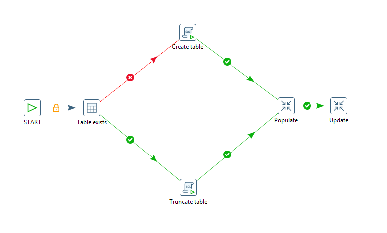
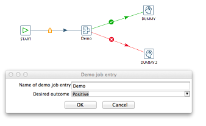

* [Create Job Entry Plugins](#create-job-entry-plugins)
  * [Implementing a Job Entry](#implementing-a-job-entry)
  * [Implementing the Job Entry Settings Dialog Box](#implementing-the-job-entry-settings-dialog-box)
  * [Logging in Job Entries](#logging-in-job-entries)
* [Deploying Job Entry Plugins](#deploying-job-entry-plugins)
* [Sample Job Entry Plugin](#sample-job-entry-plugin)
* [Exploring More Job Entries](#sxploring-more-job-entries)

## Create Job Entry Plugins

A job entry implements a logical task in ETL control flow. Job entries are executed in sequence, each job entry generating a boolean result that can be used for conditional branching in the job sequence.

 
This section explains the architecture and programming concepts for creating your own PDI job entry plugin. We recommended that you open and refer to the sample job entry plugin sources while following these instructions.
A job entry plugin integrates with PDI by implementing two distinct Java interfaces. Each interface represents a set of responsibilities performed by a PDI job. Each of the interfaces has a base class that implements the bulk of the interface in order to simplify plugin development.
All job entry interfaces and corresponding base classes are part of the org.pentaho.di.job.entry package.

Java Interface | Base Class | Main Responsibilities
-------------- | ---------- | ---------------------
`JobEntryInterface` | `JobEntryBase` | Maintain job entry settings, Serialize job entry settings, Provide access to dialog class, Execute job entry task
`JobEntryDialogInterface` | `JobEntryDialog` | Job entry settings dialog

### Implementing a Job Entry

Type | Class
---- | -----
Java Interface | `org.pentaho.di.job.entry.JobEntryInterface`
Base class | `org.pentaho.di.job.entry.JobEntryBase`

`JobEntryInterface` is the main Java interface that a plugin implements.  

**Keep Track of Job Entry Settings**

The implementing class keeps track of job entry settings using private fields with corresponding get and set methods. The dialog class implementing `JobEntryDialogInterface` uses these methods to copy the user supplied configuration in and out of the dialog box.

`public Object clone()`

This method is called when a job entry is duplicated in Spoon. It returns a deep copy of the job entry object. It is essential that the implementing class creates proper deep copies if the job entry configuration is stored in modifiable objects, such as lists or custom helper objects.

**Serialize Job Entry Settings**

The plugin serializes its settings to both XML and a PDI repository.

`public String getXML()`

This method is called by PDI whenever a job entry serializes its settings to XML. It is called when saving a job in Spoon. The method returns an XML string containing the serialized settings. The string contains a series of XML tags, one tag per setting. The helper class, `org.pentaho.di.core.xml.XMLHandler`, constructs the XML string.

`public void loadXML() `

This method is called by PDI whenever a job entry reads its settings from XML. The XML node containing the job entry settings is passed in as an argument. Again, the helper class, `org.pentaho.di.core.xml.XMLHandler`, is used to read the settings from the XML node.

`public void saveRep()`

This method is called by PDI whenever a job entry saves its settings to a PDI repository. The repository object passed in as the first argument provides a convenient set of methods for serializing job entry settings. When calling repository serialization methods, job id and job entry id are required. The job id is passed in to `saveRep()` as an argument, and the job entry id can be obtained by a call to `getObjectId()` inherited from the base class.

`public void loadRep()`

This method is called by PDI whenever a job entry reads its configuration from a PDI repository. The job entry id given in the arguments is used as the identifier when using the repositories serialization methods. When developing plugins, make sure the serialization code is in synch with the settings available from the job entry dialog. When testing a plugin in Spoon, PDI internally saves and loads a copy of the job before it is executed. 

**Provide the Name of the Dialog Class**

PDI needs to know which class takes care of the settings dialog box for the job entry. The interface method `getDialogClassName()` returns the name of the class implementing the `JobEntryDialogInterface`.

**Provide Information About Possible Outcomes**

A job entry may support up to three types of outgoing hops: True, False, and Unconditional. Sometimes it does not make sense to support all three. For instance, if the job entry performs a task that does not produce a boolean outcome, like the dummy job entry, it may make sense to suppress the True and False outgoing hops. There are other job entries, which carry an inherent boolean outcome, such as the File Exists job entry. It may make sense in such cases to suppress the unconditional outgoing hop.

The job entry plugin class must implement two methods to indicate to PDI which outgoing hops it supports.

`public boolean evaluates()`

This method returns true if the job entry supports the True and False outgoing hops. If the job entry does not support distinct outcomes, it returns false.

`public boolean isUnconditional()`

This method returns true if the job entry supports the unconditional outgoing hop. If the job entry does not support the unconditional hop, it returns false.

**Execute the Job Entry Task**

The class implementing `JobEntryInterface` executes the actual job entry task.

`public Result execute()`

The `execute()` method is called by PDI when it is time for the job entry to execute its logic. The arguments are a result object, which is passed in from the previously executed job entry, and an integer number indicating the distance of the job entry from the start entry of the job.

The job entry should execute its configured task and report back on the outcome. A job entry does that by calling specified methods on the passed in result object. 

`prev_result.setNrErrors()`

The job entry indicates whether it has encountered any errors during execution. If there are errors, `setNrErrors` calls with the number of errors encountered. Typically, this is 1. If there are no errors, `setNrErrors` is called with an argument of zero (0).

`prev_result.setResult()`

The job entry must indicate the outcome of the task. This value determines which output hops follow next. If a job entry does not support evaluation, it need not call `prev_result.setResult()`.

Finally, the passed in prev_result object is returned.

**Interface with the PDI plugin system**

The class implementing `JobEntryInterface` must be annotated with the `JobEntry` Java annotation. Supply the following annotation attributes:

Attribute | Description
id | A globally unique ID for the job entry
image | The resource location for the png icon image of the job entry
name | A short label for the job entry
description | A longer description for the job entry
categoryDescription | The category the entry should appear under in the PDI job entry tree. For example General, Utility, File Management, etc.
i18nPackageName | If the i18nPackageName attribute is supplied in the annotation attributes, the values of name, description, and categoryDescription are interpreted as i18n keys relative to the message bundle contained in given package. The keys may be supplied in the extended form  `i18n:<packagename>` key to specify a package that is different from the package given in the i18nPackageName attribute.

Please refer to the Sample Job Entry Plugin for a complete implementation example.  

### Implementing the Job Entry Settings Dialog Box

Type | Class
Java Interface | `org.pentaho.di.job.entry.JobEntryDialogInterface`
Base class | `org.pentaho.di.ui.job.entry.JobEntryDialog`

`JobEntryDialogInterface` is the Java interface that implements the settings dialog of a job entry plugin.

**Maintain the Dialog for Job Entry Settings**

The dialog class is responsible for constructing and opening the settings dialog for the job entry. When you open the job entry settings in Spoon, the system instantiates the dialog class passing in the `JobEntryInterface` object and calling the `open()` method on the dialog. SWT is the native windowing environment of Spoon and the framework used for implementing job entry dialogs.

`public JobEntryInterface open()`

This method returns only after the dialog has been confirmed or cancelled. The method must conform to these rules.
* If the dialog is confirmed
  * The `JobEntryInterface` object must be updated to reflect the new settings
  * If you changed any settings, the Changed flag of the `JobEntryInterface` object must be set to true
  * `open()` returns the `JobEntryInterface` object
* If the dialog is cancelled
  * The `JobEntryInterface` object must not be changed
  * The Changed flag of the `JobEntryInterface` object must be set to the value it had at the time the dialog opened
`open()` must return null

The `JobEntryInterface` object has an internal Changed flag that is accessible using `hasChanged()` and `setChanged()`. Spoon decides whether the job has unsaved changes based on the Changed flag, so it is important for the dialog to set the flag appropriately.

Additionally, the job entry dialog must make sure that the job entry name is not set to be empty. The dialog may be confirmed only after a non-empty name is set.

The sample Job Entry plugin project has an implementation of the `dialog` class that is consistent with these rules and is a good basis for creating your own dialogs. 

### Logging in Job Entries

A job entry interacts with the PDI logging system by using the logging methods inherited from `JobEntryBase`.

These methods are used to issue log lines to the PDI logging system on different severity levels. Multi-argument versions of the methods are available to do some basic formatting, which is equivalent to a call to `MessageFormat.format(message, arguments)`.

* `public void logMinimal()`
* `public void logBasic()`
* `public void logDetailed()`
* `public void logDebug()`
* `public void logRowlevel()`
* `public void logError()`

These methods query the logging level. They are often used to guard sections of code, that should only be executed with elevated logging settings.

* `public boolean isBasic()`
* `public boolean isDetailed()`
* `public boolean isDebug()`
* `public boolean isRowLevel()`

Job entries should log the this information at specified levels:

Log Level | Log Information Content
--------- | -----------------------
Minimal | Only information that is interesting at a very high-level, for example Job Started or Ended jobs. Individual job entries do not log anything at this level.
Basic | Information that may be interesting to you during regular ETL operation
Detailed | Prepared SQL or other query statements, resource allocation and initialization like opening files or connections
Debug | Anything that may be useful in debugging job entries
Row Level | Anything that may be helpful in debugging problems at the level of individual rows and values
Error | Fatal errors that abort the job

## Deploying Job Entry Plugins

To deploy your plugin, follow the following steps.

1. Create a jar file containing your plugin classes and resources
2. Create a new folder, give it a meaningful name, and place your jar file inside the folder
3. Place the plugin folder you just created in a specific location for PDI to find. Depending on how you use PDI, you need to copy the plugin folder to one or more locations as per the following list.
  * Deploying to Spoon or Carte
    * Copy the plugin folder into this location: `design-tools/data-integration/plugins/jobentries`
    * After restarting Spoon, the new job entry is available for use.
  * Deploying to Data Integration Server
    * Copy the plugin folder to this location: `server/data-integration-server/pentaho-solutions/system/kettle/plugins/jobentries`
    * After restarting the data integration server, the plugin is available to the server.
  * Deploying to BA Server
    * Copy the plugin folder to this location: `server/biserver-ee/pentaho-solutions/system/kettle/plugins/jobentries`
    * After restarting the BA Server, the plugin is available to the server.

## Sample Job Entry Plugin

The sample Job Entry plugin project is designed to show a minimal functional implementation of a job entry plugin that you can use as a basis to develop your own custom job entries.

The sample Job Entry plugin functionality lets you manually configure which outcome to generate.  This screen shot shows the job entry configuration dialog and outgoing hops.

* Obtain the Sample Plugin Source
  * The plugin source is available in the download package. Download the package and unzip it. The job entry plugin resides in the `kettle-sdk-jobentry-plugin` folder.
* Build and Deploy
  * Build and Deploy From the Command Line
    * The plugin is built using Apache Maven. Build and deploy the plugin from the command line by invoking the package target (e.g. `mvn package`). 
    * The package target compiles the source, creates a jar file, creates a plugin zip file, which can be unzipped and copied into the `plugins/jobentries` directory of your PDI installation.
  * Open Spoon, and verify that the new job entry is available as "Demo" in the Conditions section.

## Exploring More Job Entries

PDI sources provide example implementations of job entries. Each PDI core job entry is located in a sub-package of `org.pentaho.di.job.entries` found in the `engine/src` folder. The corresponding dialog class is located in `org.pentaho.di.ui.job.entries` found in the `ui/src` folder.

For example, these are the classes that make up the File Exists job entry:

* `org.pentaho.di.job.entries.fileexists.JobEntryFileExists`
* `org.pentaho.di.ui.job.entries.fileexists.JobEntryFileExistsDialog`

The `dialog` classes of the core PDI job entries are located in a different package and source folder. They are also assembled into a separate jar file. This allows PDI to load the UI-related jar file when launching Spoon and avoid loading the UI-related jar when it is not needed.