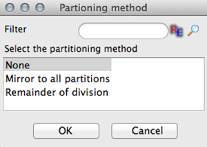
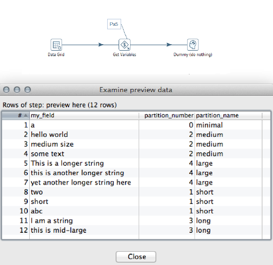

* [Create Partitioner Plugins](#create-partitioner-plugins)
  * [Implementing the Partitioner Interface](#implementing-the-partitioner-interface)
  * [Implementing the Partitioner Settings Dialog Box](#implementing-the-partitioner-settings-dialog-box)
* [Deploying Partitioner Plugins](#deploying-partitioner-plugins)
* [Sample Partitioner Plugin](#sample-partitioner-plugin)
* [Exploring Existing Partitioners](#exploring-existing-partitioners)

## Create Partitioner Plugins

PDI uses partitioner plugins for its partitioning feature. Each partitioner plugin implements a specific partitioning method.

For most applications, the Remainder of Division partitioner works well. On the rare occasion that an application would benefit from an additional partitioning method, this section explains how to implement them.

This section explains the architecture and programming concepts for creating your own partitioner plugin. We recommended you open and refer to the sample partitioner plugin sources while following these instructions.

A partitioner plugin integrates with PDI by implementing two distinct Java interfaces. Each interface represents a set of responsibilities performed by a PDI partitioner. Each of the interfaces has a base class that implements the bulk of the interface in order to simplify plugin development.

Package | Interface | Base Class | Main Responsibilities
------- | --------- | ---------- | ---------------------
`org.pentaho.di.trans` | `Partitioner` | `BasePartitioner` | Maintain partitioner settings, Serialize partitioner enumerations, Provide access to dialog class, Assign rows to partitions during runtime
`org.pentaho.di.ui.trans.step` | `StepDialogInterface` | `BaseStepDialog` | Partitioner settings dialog
Additional Reading
A complete explanation of partitioning in Kettle, including sample transformations, is available [here][Partitioning Explanation].

### Implementing the Partitioner Interface

Type | Class
---- | -----
Java Interface | `org.pentaho.di.trans.Partitioner`
Base class  | `org.pentaho.di.trans.BasePartitioner`

`Partitioner` is the main Java interface that a plugin implements.

**Keep Track of Partitioner Settings**

The implementing class keeps track of partitioner settings using private fields with corresponding `get` and `set` methods. The `dialog` class implementing `PartionerDialogInterface` is using these methods to copy the user supplied configuration in and out of the dialog.

`public Object clone()`

This method is called when a step containing partitioning configuration is duplicated in Spoon. It needs to return a deep copy of this partitioner object. It is essential that the implementing class creates proper deep copies if the configuration is stored in modifiable objects, such as lists or custom helper objects. The copy is created by calling `super.clone()` and deep-copying any fields the partitioner may have declared.

`public Partitioner getInstance()`

This method is required to return a new instance of the partitioner class, with the plugin id and plugin description inherited from the instance upon which this method is called.

**Serialize Partitioner Settings**

The plugin serializes its settings to both XML and a PDI repository.

`public String getXML()`

This method is called by PDI whenever the plugin needs to serialize its settings to XML. It is called when saving a transformation in Spoon. The method returns an XML string containing the serialized settings. The string contains a series of XML tags, one tag per setting. The helper class `org.pentaho.di.core.xml.XMLHandler` constructs the XML string.

`public void loadXML()`

This method is called by PDI whenever a plugin reads its settings from XML. The XML node containing the plugin settings is passed in as an argument. Again, the helper class `org.pentaho.di.core.xml.XMLHandler` is used to read the settings from the XML node.

`public void saveRep()`

This method is called by PDI whenever a plugin saves its settings to a PDI repository. The repository object passed in as the first argument provides a convenient set of methods for serializing settings. The transformation id and step id passed in are used as identifiers when calling the repository serialization methods.

`public void readRep()`

This method is called by PDI whenever a plugin needs to read its configuration from a PDI repository. The step id given in the arguments should be used as the identifier when using the repositories serialization methods.

When developing plugins, make sure the serialization code is in synch with the settings available from the partitioner plugin dialog. When testing a partitioned step in Spoon, PDI internally saves and loads a copy of the transformation before it is executed. 

**Provide the Name of the Dialog Class**

PDI needs to know which class will take care of the settings dialog for the plugin. The interface method `getDialogClassName()` must return the name of the class implementing the `StepDialogInterface` for the partitioner. 

**Partition Incoming Rows During Runtime**

The class implementing `Partitioner` executes the actual logic that distributes the rows to available partitions.

`public int getPartition()`

This method is called with the row structure and the actual row as arguments. It returns the partition to which this row is sent. The total number of partitions is available in the inherited field `nrPartitions` and the return value is between zero (0, inclusive) and `nrPartitions` (exclusive).

**Interface with the PDI plugin system**

In order for PDI to recognize the plugin, the class implementing the `Partitioner` interface must also be annotated with the Java annotation `org.pentaho.di.core.annotations.PartitionerPlugin`.

Supply these annotation attributes:

Attribute | Description
--------- | -----------
`id` | A globally unique ID for the plugin
`name` | A short label for the plugin
`description` | A longer description for the plugin
`i18nPackageName` | If the `i18nPackageName` attribute is supplied in the annotation attributes, the values of name and description are interpreted as i18n keys. The keys may be supplied in the extended form  `i18n:<packagename>` key to specify a package that is different from the default package given in the `i18nPackageName` attribute.

### Implementing the Partitioner Settings Dialog Box

Type | Class
---- | -----
Java Interface | `org.pentaho.di.trans.step.StepDialogInterface`
Base class | `org.pentaho.di.ui.trans.step.BaseStepDialog`

`StepDialogInterface` is the Java interface that implements the settings dialog of a partitioner plugin.

**Maintain the Dialog for Partitioner Settings**

The `dialog` class is responsible for constructing and opening the settings dialog for the partitioner. When you open the partitioning settings in Spoon, the system instantiates the `dialog` class passing in a `StepPartitioningMeta` object. Retrieve the `Partitioner` object by calling `getPartitioner()` and call the `open()` method on the dialog. [SWT][SWT] is the native windowing environment of Spoon and the framework used for implementing dialogs. 

`public String open()`

This method returns only after the dialog has been confirmed or cancelled. The method must conform to these rules. 

* If the dialog is confirmed
  * The Partition object must be updated to reflect the new settings
  * If you changed any settings, the `StepPartitioningMeta` object `changed` flag must be set to true
  * `open()` returns the name of the step to which the partitioning is applied—use the stepname field inherited from `BaseStepDialog`
* If the dialog is cancelled
  * The `Partition` object must not be changed
  * The `StepPartitioningMeta` object Changed flag must be set to the value it had at the time the dialog opened
`open()` must return null

The `StepPartitioningMeta` object has an internal `changed` flag that is accessible using `hasChanged()` and `setChanged()`. Spoon decides whether the transformation has unsaved changes based on the `changed` flag, so it is important for the dialog to set the flag appropriately.

The sample Partitioner plugin project has an implementation of the dialog class that is consistent with the these rules and is a good basis for creating your own dialogs.

## Deploying Partitioner Plugins

To deploy your plugin, follow the following steps.

1. Create a jar file containing your plugin class(es)
2. Create a new folder, give it a meaningful name, and place your jar file inside the folder
3. Place the plugin folder you just created in a specific location for PDI to find. Depending on how you use PDI, you need to copy the plugin folder to one or more locations as per the following list.
  * Deploying to Spoon or Carte

    Copy the plugin folder into this location: `design-tools/data-integration/plugins/steps`

    After restarting Spoon, the new database type is available from the PDI database dialog.
  * Deploying to Data Integration Server

    Copy the plugin folder to this location: `server/data-integration-server/pentaho-solutions/system/kettle/plugins/steps`

    After restarting the data integration server, the plugin is available to the server.
  * Deploying to BA Server

    Copy the plugin folder to this location: `server/biserver-ee/pentaho-solutions/system/kettle/plugins/steps`

    After restarting the BA Server, the plugin is available to the server.

## Sample Partitioner Plugin

The sample Partitioner plugin project is designed to show a minimal functional implementation of a partitioner plugin that you can use as a basis to develop your own custom plugins.

The sample Partitioner plugin distributes rows to partitions based on the value of a string field, or more precisely the string length. The sample shows a partitioner executing on five partitions, assigning longer strings to higher partition numbers.

Follow these steps in order to build and deploy the sample plugin.

1. Obtain the Sample Plugin Source
  * The plugin source is available in the download package. Download the package and unzip it. The partitioner plugin resides in the `kettle-sdk-partitioner-plugin` folder.
2. Build and Deploy
  * You may choose to build and deploy the plugin from the command line, or work with the Eclipse IDE instead. Both options are described below.
  * Build and Deploy From the Command Line
    * The plugin is built using [Apache Maven][Apache Maven]. Build and deploy the plugin from the command line by invoking the package target (e.g. `mvn package`).
    * The package target compiles the source, creates a jar file, and creates a plugin archive that can be unzipped and placed into the `plugins/steps` directory of your PDI installation.
3. You can test the new plugin using the transformation from the `demo_transform` folder.

## Exploring Existing Partitioners

PDI sources are useful if you want to investigate the implementation of the standard modulo partitioner. The main class is available as [`org.pentaho.di.trans.ModPartitioner`][ModPartitioner Class]. The corresponding dialog class in located in [`org.pentaho.di.ui.trans.dialog.ModPartitionerDialog`][ModPartitionerDialog Class].

[Partitioning Explanation]: http://type-exit.org/adventures-with-open-source-bi/2011/09/partitioning-in-kettle/
[SWT]: http://www.eclipse.org/swt/
[Apache Maven]: https://maven.apache.org/
[ModPartitioner Class]: http://javadoc.pentaho.com/kettle530/kettle-engine-5.3.0.0-javadoc/org/pentaho/di/trans/ModPartitioner.html
[ModPartitionerDialog Class]: http://javadoc.pentaho.com/kettle530/kettle-ui-swt-5.3.0.0-javadoc/org/pentaho/di/ui/trans/dialog/ModPartitionerDialog.html