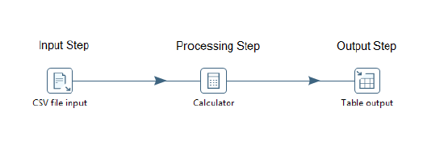
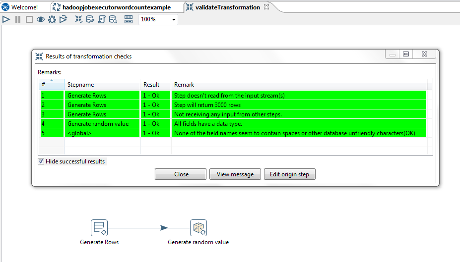
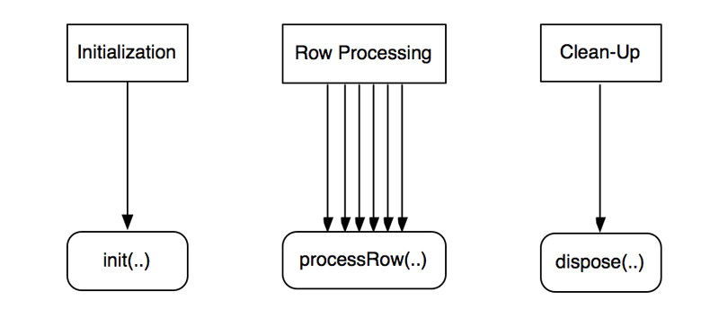
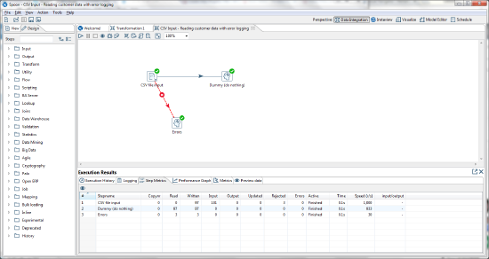
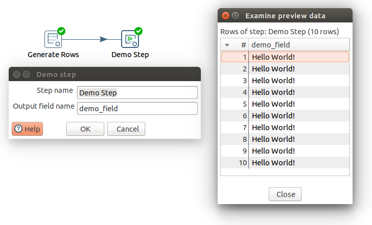
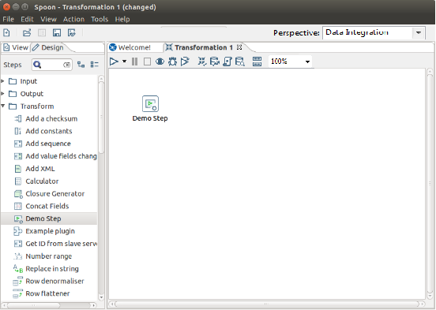

* [Create Step Plugins](#create-step-plugins)
  * [Using Your Icon in PDI](#using-your-icon-in-pdi)
  * [Maintain Step Settings](#maintain-step-settings)
  * [Implement the Step Settings Dialog Box](#implement-the-step-settings-dialog-box)
  * [Process Rows](#process-rows)
  * [Storing the Processing State](#storing-the-processing-state)
  * [Work with Rows](#work-with-rows)
  * [Work With Fields](#work-with-fields)
  * [Handling Errors](#handling-errors)
  * [Understanding Row Counters](#understanding-row-counters)
  * [Logging in Transformation Steps](#logging-in-transformation-steps)
* [Testing your PDI Plugin](#testing-your-pdi-plugin)
* [Deploy Step Plugins](#deploy-step-plugins)
* [Sample Step Plugin](#sample-step-plugin)
* [Exploring More Steps](#exploring-more-steps)

## Create Step Plugins

A transformation step implements a data processing task in an ETL data flow. It operates on a stream of data rows. Transformation steps are designed for input, processing, or output. Input steps fetch data rows from external data sources, such as files or databases. Processing steps work with data rows, perform field calculations, and stream operations, such as joining or filtering. Output steps write the processed data back to storage, files, or databases.

This section explains the architecture and programming concepts for creating your own PDI transformation step plugin. We recommended that you open and refer to the sample step plugin sources while following these instructions.

A step plugin integrates with PDI by implementing four distinct Java interfaces. Each interface represents a set of responsibilities performed by a PDI step. Each of the interfaces has a base class that implements the bulk of the interface in order to simplify plugin development.

Unless noted otherwise, all step interfaces and corresponding base classes are part of the `org.pentaho.di.trans.step` package. 

Java Interface | Base Class | Main Responsibilities
-------------- | ---------- | ---------------------
StepMetaInterface | `BaseStepMeta` | Maintain, validate, and serialize step settings. Provide access to step classes. Perform row layout changes
StepDialogInterface | `org.pentaho.di.ui.trans.step.BaseStepDialog` | Step settings dialog
StepInterface | `BaseStep` | Process rows
StepDataInterface | `BaseStepData` | Store processing state, and to declare and serve as a place for field variables during row processing
Using Your Icon in PDI

### Using Your Icon in PDI
Now that you have an image which provides a quick, intuitive representation of what your Step or Entry does and
maintains consistency with other user interface elements within PDI, you need to save it delete in the proper format and to the proper location.
**Including Images in a Kettle Plugin**

1. Save your icon to Scalable Vector Graphics (SVG) Version 1.1 format.
2. Place the image in the plugin.  The specifics of the plugin's assembly will indicate where to put the image, but usually it is placed in the your-plugin-project/src folder.
3. The image will be loaded, at runtime, from the plugin’s jar file.  The location of the file is indicated by the JobMeta or StepMeta for your plugin.  This is usually accomplished with a Java annotation, like in this example:

        @JobEntry(
            id = "HadoopCopyFilesPlugin",    
            image = "HDM.svg",
            name = "HadoopCopyFilesPlugin.Name",
            description = "HadoopCopyFilesPlugin.Description",
            categoryDescription = "i18n:org.pentaho.di.job:JobCategory.Category.BigData",
            i18nPackageName = "org.pentaho.di.job.entries.hadoopcopyfiles" )
        public class JobEntryHadoopCopyFiles extends JobEntryCopyFiles {

4. If you have developed a dialog (UI) for your plugin, you might want an SVG graphic to appear, as per UX standards.  This code should be put in your plugin, in the Job or Step classes. This can be done like this:

        icon.setImage( UIResource.getInstance().getImage( "ModelAnnotation.svg", getClass().getClassLoader(), ConstUI.ICON_SIZE, ConstUI.ICON_SIZE ) );

### Maintain Step Settings

Type           | Class
-------------- | -------------------------------------------
Java Interface | `org.pentaho.di.trans.step.StepMetaInterface`
Base class | `org.pentaho.di.trans.step.BaseStepMeta`

The StepMetaInterface is the main Java interface that a plugin implements.

**Keep Track Of the Step Settings**

The implementing class keeps track of step settings using private fields with corresponding get and set methods. The dialog class implementing StepDialogInterface uses these methods to copy the user supplied configuration in and out of the dialog.

These interface methods are also used to maintain settings.

`void setDefault()`

This method is called every time a new step is created and allocates or sets the step configuration to sensible defaults. The values set here are used by Spoon when a new step is created. This is a good place to ensure that the step settings are initialized to non-null values. Values that are null can be cumbersome to deal with in serialization and dialog population, so most PDI step implementations stick to non-null values for all step settings.

`public Object clone()`

This method is called when a step is duplicated in Spoon. It returns a deep copy of the step meta object. It is essential that the implementing class creates proper deep copies if the step configuration is stored in modifiable objects, such as lists or custom helper objects.
See `org.pentaho.di.trans.steps.rowgenerator.RowGeneratorMeta.clone()` in the PDI source for an example of creating a deep copy.

**Serialize Step Settings**

The plugin serializes its settings to both XML and a PDI repository. These interface methods provide this functionality.

`public String getXML()`

This method is called by PDI whenever a step serializes its settings to XML. It is called when saving a transformation in Spoon. The method returns an XML string containing the serialized step settings. The string contains a series of XML tags, one tag per setting. The helper class, org.pentaho.di.core.xml.XMLHandler, constructs the XML string.

`public void loadXML()` 

This method is called by PDI whenever a step reads its settings from XML. The XML node containing the step settings is passed in as an argument. Again, the helper class, org.pentaho.di.core.xml.XMLHandler, reads the step settings from the XML node.

`public void saveRep()`

This method is called by PDI whenever a step saves its settings to a PDI repository. The repository object passed in as the first argument provides a set of methods for serializing step settings. The passed in transformation id and step id are used by the step as identifiers when calling the repository serialization methods.

`public void readRep()`

This method is called by PDI whenever a step reads its configuration from a PDI repository. The step id given in the arguments is used as the identifier when using the repositories serialization methods.

When developing plugins, make sure the serialization code is in synch with the settings available from the step dialog. When testing a step in Spoon, PDI internally saves and loads a copy of the transformation before executing it. 

**Provide Instances of Other Plugin Classes**

The `StepMetaInterface` plugin class is the main class, tying in with the rest of PDI architecture. It is responsible for supplying instances of the other plugin classes implementing `StepDialogInterface`, `StepInterface`, and `StepDataInterface`. The following methods cover these responsibilities. Each method implementation constructs a new instance of the corresponding class, forwarding the passed in arguments to the constructor.

* `public StepDialogInterface getDialog()`
* `public StepInterface getStep()`
* `public StepDataInterface getStepData()`

Each of these methods returns a new instance of the plugin class implementing `StepDialogInterface`, `StepInterface`, and `StepDataInterface`.

**Report Step Changes to the Row Stream**

PDI needs to know how a step affects the row structure. A step may be adding or removing fields, as well as modifying the metadata of a field. The method implementing this aspect of a step plugin is `getFields()`.

`public void getFields()`

Given a description of the input rows, the plugin modifies it to match the structure for its output fields. The implementation modifies the passed in [RowMetaInterface][RowMetaInterface] object to reflect changes to the row stream. A step adds fields to the row structure. This is done by creating objects using the [ValueMetaFactory][ValueMetaFactory], and appending them to the `RowMetaInterface` object. The Working with Fields section goes into deeper detail about `ValueMetaInterface`. 

This sample transformation uses two steps. The Demo step adds the field, `demo_field`, to empty rows produced by the Generate Rows step. 

**Validate Step Settings**

Spoon supports a Validate Transformation feature, which triggers a self-check of all steps.  PDI invokes the `check()` method of each step on the canvas, allowing each step to validate its settings.

`public void check()`

Each step has the opportunity to validate its settings and verify that the configuration given by the user is reasonable. In addition, a step checks if it is connected to preceding or following steps, if the nature of the step requires that kind of connection. An input step may expect to not have a preceding step for example. The check method passes in a list of check remarks, to which the method appends its validation results. Spoon displays the list of remarks collected from the steps, allowing you to take corrective action in case there are validation warnings or errors.

**Interface with the PDI plugin system**

The class implementing `StepMetaInterface` must be annotated with the [Step][Step] Java annotation. Supply the following annotation attributes:

Attribute | Description
--------- | -----------
id                  | A globally unique ID for the step
image               | The resource location for the png icon image of the step
name                | A short label for the step
description         | A longer description for the step
categoryDescription | The category the step should appear under in the PDI step tree. For example Input, Output, Transform, etc.
i18nPackageName     | If the `i18nPackageName` attribute is supplied in the annotation attributes, the values of name, description, and categoryDescription are interpreted as `i18n` keys relative to the message bundle contained in given package. The keys may be supplied in the extended form `i18n:<packagename>` key to specify a package that is different from the package given in the `i18nPackageName` attribute.

Please refer to the Sample Step Plugin for a complete implementation example.

### Implement the Step Settings Dialog Box

Type           | Class
-------------- | ---------------
Java Interface | `org.pentaho.di.trans.step.StepDialogInterface `
Base class     | `org.pentaho.di.ui.trans.step.BaseStepDialog`

`StepDialogInterface` is the Java interface that implements the plugin settings dialog.

**Maintain the Dialog for Step Settings**

The `dialog` class is responsible for constructing and opening the settings dialog for the step. Whenever you open the step settings in Spoon, the system instantiates the `dialog` class passing in the `StepMetaInterface` object and calling `open()` on the dialog. [SWT][SWT] is the native windowing environment of Spoon and is the framework used for implementing step dialogs. 

`public String open()`

This method returns only after the dialog has been confirmed or canceled. The method must conform to these rules. 

* If the dialog is confirmed
  * The `StepMetaInterface` object must be updated to reflect the new step settings
  * If you changed any step settings, the Changed flag of the `StepMetaInterface` object flag must be set to true
  * `open()` returns the name of the step
* If the dialog is canceled
  * The `StepMetaInterface` object must not be changed
  * The Changed flag of the `StepMetaInterface` object must be set to the value it had at the time the dialog opened
  * `open()` must return null

The `StepMetaInterface` object has an internal Changed flag that is accessible using `hasChanged()` and `setChanged()`. Spoon decides whether the transformation has unsaved changes based on the Changed flag, so it is important for the dialog to set the flag appropriately. 

The sample step plugin project has an implementation of the dialog class that is consistent with these rules and is a good basis for creating your own dialog.  

### Process Rows

Type           | Class
-------------- | -----------------
Java Interface | `org.pentaho.di.trans.step.StepInterface`  
Base class     | `org.pentaho.di.trans.step.BaseStep`

The class implementing `StepInterface` is responsible for the actual row processing when the transformation runs. 

The implementing class can rely on the base class and has only three important methods it implements itself. The three methods implement the step life cycle during transformation execution: initialization, row processing, and clean-up.

During initialization PDI calls the `init()` method of the step once. After all steps have initialized, PDI calls `processRow()` repeatedly until the step signals that it is done processing all rows. After the step is finished processing rows, PDI calls `dispose()`. 

The method signatures have a `StepMetaInterface` object and a `StepDataInterface` object. Both objects can be safely cast down to the specific implementation classes of the step. 

Aside from the methods it needs to implement, there is one additional and very important rule: the class must not declare any fields. All variables must be kept as part of the class implementing `StepDataInterface`. In practice this is not a problem, since the object implementing `StepDataInterface` is passed in to all relevant methods, and its fields are used instead of local ones. The reason for this rule is the need to decouple step variables from instances of `StepInterface`. This enables PDI to implement different threading models to execute a transformation. 

**Step Initialization**

The `init()` method is called when a transformation is preparing to start execution. 

`public boolean init()`

Every step is given the opportunity to do one-time initialization tasks, such as opening files or establishing database connections. For any steps derived from `BaseStep`, it is mandatory that `super.init()` is called to ensure correct behavior. The method returns `true` in case the step initialized correctly, it returns `false` if there is an initialization error. PDI will abort the execution of a transformation in case any step returns `false` upon initialization.

**Row Processing**

Once the transformation starts, it enters a tight loop, calling `processRow()` on each step until the method returns `false`. In most cases, each step reads a single row from the input stream, alters the row structure and fields, and passes the row on to the next step. Some steps, such as input, grouping, and sorting steps, read rows in batches, or can hold on to the read rows to perform other processing before passing them on to the next step.

`public boolean processRow()`

 PDI step queries for incoming input rows by calling `getRow()`, which is a blocking call that returns a row object or `null` in case there is no more input. If there is an input row, the step does the necessary row processing and calls `putRow()` to pass the row on to the next step. If there are no more rows, the step calls `setOutputDone()` and returns `false`.

The method must conform to these rules.

* If the step is done processing all rows, the method calls `setOutputDone()` and returns false.
* If the step is not done processing all rows, the method returns true. PDI calls `processRow()` again in this case.

The sample step plugin project shows an implementation of `processRow()` that is commonly used in data processing steps.

In contrast to that, input steps do not usually expect any incoming rows from previous steps. They are designed to execute `processRow()` exactly once, fetching data from the outside world, and putting them into the row stream by calling `putRow()` repeatedly until done. Examining existing PDI steps is a good guide for designing your `processRow()` method. 

The row structure object is used during the first invocation of `processRow()` to determine the indexes of fields on which the step operates. The `BaseStep` class already provides a convenient First flag to help implement special processing on the first invocation of `processRow()`. Since the row structure is equal for all input rows, steps cache field index information in variables on their `StepDataInterface` object.

**Step Clean-Up**
Once the transformation is complete, PDI calls dispose() on all steps. 

`public void dispose()`

Steps are required to deallocate resources allocated during `init()` or subsequent row processing. Your implementation should clear all fields of the `StepDataInterface` object, and ensure that all open files or connections are properly closed. For any steps derived from `BaseStep`, it is mandatory that `super.dispose()` is called to ensure correct deallocation.

### Storing the Processing State

Type           | Class
-------------- | ---------------
Java Interface | org.pentaho.di.trans.step.StepDataInterface
Base class     | org.pentaho.di.trans.step.BaseStepData

The class implementing `StepInterface` does not store processing state in any of its fields. Instead an additional class implementing `StepDataInterface` is used to store processing state, including status flags, indexes, cache tables, database connections, file handles, and alike. Implementations of `StepDataInterface` declare the fields used during row processing and add accessor functions.  In essence the class implementing `StepDataInterface` is used as a place for field variables during row processing.
PDI creates instances of the class implementing `StepDataInterface` at the appropriate time and passes it on to the `StepInterface` object in the appropriate method calls. The base class already implements all necessary interactions with PDI and there is no need to override any base class methods.

### Work with Rows

A row in PDI is represented by a Java object array, `Object[]`. Each field value is stored at an index in the row. While the array representation is efficient to pass data around, it is not immediately clear how to determine the field names and types that go with the array. The row array itself does not carry this meta data. Also an object array representing a row usually has empty slots towards its end, so a row can accommodate additional fields efficiently. Consequently, the length of the row array does not equal the amount of fields in the row. The following sections explain how to safely access fields in a row array.

PDI uses internal objects that implement `RowMetaInterface` to describe and manipulate row structure. Inside `processRow()` a step can retrieve the structure of incoming rows by calling `getInputRowMeta()`, which is provided by the `BaseStep` class. The step clones the `RowMetaInterface` object and passes it to `getFields()` of its meta class to reflect any changes in row structure caused by the step itself. Now, the step has `RowMetaInterface` objects describing both the input and output rows. This illustrates how to use `RowMetaInterface` objects to inspect row structure. 

There is a similar object that holds information about individual row fields. PDI uses internal objects that implement `ValueMetaInterface` to describe and manipulate field information, such as field name, data type, format mask, and alike. 

A step looks for the indexes and types of relevant fields upon first execution of `processRow()`. These methods of `RowMetaInterface` are useful to achieve this.

Method | Purpose
------ | -------
`indexOfValue(String valueName)`    | Given a field name, determine the index of the field in the row.
`getFieldNames()`                   | Returns an array of field names. The index of a field name matches the field index in the row array.
`searchValueMeta(String valueName)` | Given a field name, determine the meta data for the field.
`getValueMeta(int index)`           | Given a field index, determine the meta data for the field.
`getValueMetaList()`                | Returns a list of all field descriptions. The index of the field description matches the field index in the row array.

If a step needs to create copies of rows, use the `cloneRow()` methods of `RowMetaInterface` to create proper copies. If a step needs to add or remove fields in the row array, use the static helper methods of `RowDataUtil`. For example, if a step is adding a field to the row, call `resizeArray()`, to add the field. If the array has enough slots, the original array is returned as is. If the array does not have enough slots, a resized copy of the array is returned. If a step needs to create new rows from scratch, use `allocateRowData()`, which returns a somewhat over-allocated object array to fit the desired number of fields.

**Summary Table of Classes and Interfaces for Row Processing**

Class/Interface | Purpose
--------------- | -------
`RowMetaInterface`   | Describes and manipulates row structure
`ValueMetaInterface` | Describes and manipulates field types and formats
`RowDataUtil`        | Allocates space in row array

### Work With Fields

**Data Type**

`ValueMetaInterface` objects are used to determine the characteristics of the row fields. They are typically obtained from a `RowMetaInterface` object, which is acquired by a call to `getInputRowMeta()`. The `getType()` method returns one of the static constants declared by `ValueMetaInterface` to indicate the PDI field type. Each field type maps to a corresponding native Java type for the actual value. The following table illustrates the mapping of the most frequently used field types.

PDI data type | Type constant | Java data type | Description
------------- | ------------- | -------------- | -----------
String        | TYPE_STRING    | `java.lang.String`     | A variable unlimited length text encoded in UTF-8 (Unicode) 
Integer       | TYPE_INTEGER   | `java.lang.Long`       | A signed long 64-bit integer 
Number        | TYPE_NUMBER    | `java.lang.Double`     | A double precision floating point value 
BigNumber     | TYPE_BIGNUMBER | `java.math.BigDecimal` | An arbitrary unlimited precision number 
Date          | TYPE_DATE      | `java.util.Date`       | A date-time value with millisecond precision 
Boolean       | TYPE_BOOLEAN   | `java.lang.Boolean`    | A boolean value true or false
Binary        | TYPE_BINARY    | `java.lang.byte[]`     | An array of bytes that contain any type of binary data.

Do not assume that the Java value of a row field matches these data types directly. This may or may not be true, based on the storage type used for the field.

**Storage Types**

In addition to the data type of a field, the storage type, `getStorageType()`/`setStorageType()`, is used to interpret the actual field value in a row array. These storage types are available.

Type constant | Actual field data type | Interpretation
------------- | ---------------------- | -------------- 
STORAGE_TYPE_NORMAL         | As listed in previous table | The value in the row array is of the type listed in the data type table above and represents the field value directly.
STORAGE_TYPE_BINARY_STRING  | `java.lang.byte[]`          | The field has been created using the Lazy Conversion feature. This means it is a non-altered sequence of bytes as read from an external medium, usually a file. 
STORAGE_TYPE_INDEXED        | `java.lang.Integer`         | The row value is an integer index into a fixed array of possible values. The `ValueMetaInterface` object maintains the set of possible values in `getIndex()`/`setIndex()`

**Accessing Row Values**

In a typical data processing scenario, a step is not interested in dealing with the complexities of the storage type. It just needs the actual data value on which to do processing. In order to safely read the value of a field, the `ValueMetaInterface` object provides a set of accessor methods to get at the actual Java value. The argument is a value from a row array that corresponds to the `ValueMetaInterface` object. The accessor methods always return a proper data value, regardless of the field storage type.

* `getString()`
* `getInteger()`
* `getNumber()`
* `getBigNumber()`
* `getDate()`
* `getBoolean()`
* `getBinary()`

For each of these methods, `RowMetaInterface` has corresponding methods that require the row array and the index of the field as arguments.

**Additional Field Characteristics**

`ValueMetaInterface` represents all aspects of a PDI field, including conversion masks, trim type, and alike. All of these are available using corresponding accessor methods, such as `getConversionMask()` and `getTrimType()`. Refer to the [Javadoc][ValueMetaInterface] for a complete overview.

### Handling Errors

Transformation steps may encounter errors at many levels. They may encounter unexpected data, or problems with the execution environment. Depending on the nature of the error, the step may decide to stop the transformation by throwing an exception, or support the PDI Error Handling feature, which allows you to divert bad rows to an error handling step.

**Throwing a KettleException: Calling a Hard Stop**

If a step encounters an error during row processing, it may log an error and stop the transformation. This is done by calling `setErrors(1)`, `stopAll()`, `setOutputDone()`, and returning `false` from `processRow()`. Alternatively, the step can throw a `KettleException`, which also causes the transformation to stop.

It is sensible to stop the transformation when there is a problem with the environment or configuration of a step. For example, when a database connection cannot be made, a required file is not present, or an expected field is not in the row stream. These are errors that affect the execution of the transformation as a whole. If on the other hand the error is related to row data, the step should implement support for the PDI Error Handling feature. 

**Implementing Per-Row Error Handling**

You may want to divert bad rows to a specific error handling step. This capability is referred to as the Error Handling feature. A step supporting this feature overrides the `BaseStep` implementation of `supportsErrorHandling()` to return true. This enables you to specify a target step for bad rows in the Spoon UI. During runtime, the step checks if you configured a target step for error rows by calling `getStepMeta().isDoingErrorHandling()`. If error rows are diverted, the step passes the offending input row to `putError()` and provides additional information about the errors encountered. It does not throw a `KettleException`. If you do not configure a step to generate error rows and send them to another step for processing, the step falls back to calling a hard stop.

Most core PDI steps support row-level error handling. The Number Range step is a good example. If error handling is enabled, it diverts the row into the error stream. If it is not, the step stops the transformation. 

### Understanding Row Counters

During transformation execution, each PDI step keeps track of a set of step metrics. These are displayed in Spoon in the Step Metrics tab.

Each step metric is essentially a row counter. The counters are manipulated by calling the corresponding increment, decrement, get, and set methods on `BaseStep`. This table provides a list of the counters and the correct way to use them. 

Counter Name | Meaning | When to Increment
------------ | ------- | -----------------
linesRead     | Rows received from previous steps | Never increment manually. This is handled by `getRow()`.
linesWritten  | Rows passed to next steps | Never increment manually. This is handled by `putRow()`.
linesInput    | Rows read from external sources, such as files, database, and alike | Call `incrementLinesInput()` when a new row is received from an external source.
linesOutput   | Rows written to external sources, such as files, database, and alike | Call `incrementLinesOutput()` when a row is written to an external system or file.
linesUpdated  | Rows updated in external sources, such as database, and alike | Call `incrementLinesUpdated()` when a row is updated in an external system or file.
linesSkipped  | Rows for which part of the processing has been skipped | Call `incrementLinesSkipped()` when a row was skipped. This is relevant when the step implements conditional processing, and the condition for processing a row is not satisfied. For example, an updating step may skip rows that are already up to date.
linesRejected | Rows diverted to an error step as part of error handling | Never increment manually. This is handled by `putError()`.

### Logging in Transformation Steps

A step interacts with the PDI logging system by using the logging methods inherited from `BaseStep`. 

These methods are used to issue log lines to the PDI logging system on different severity levels. Multi-argument versions of the methods are available to do some basic formatting, which is equivalent to a call to `MessageFormat.format(message, arguments)`.
* `public void logMinimal()`
* `public void logBasic()`
* `public void logDetailed()`
* `public void logDebug()`
* `public void logRowlevel()`
* `public void logError()`

These methods query the logging level. They are often used to guard sections of code, that should only be executed with elevated logging settings.

* `public boolean isBasic()`
* `public boolean isDetailed()`
* `public boolean isDebug()`
* `public boolean isRowLevel()`

Steps should log this information at specified levels.

Log Level | Log Information Content
--------- | -----------------------
Minimal  | Only information that is interesting at very high-levels, for example Transformation Started or Ended; individual steps do not log anything at this level
Basic    | Information that may be interesting to you during regular ETL operation
Detailed | Prepared SQL or other query statements, resource allocation and initialization like opening files or connections
Debug    | Anything that may be useful in debugging step operations
RowLevel | Anything that may be helpful in debugging problems at the level of individual rows and values
Error    | Fatal errors that abort the transformation

**Feedback Logging**

A transformation defines a feedback size in its settings. The feedback size defines the number of rows after which each step logs a line reporting its progress. This is implemented by calling `checkFeedback()` with an appropriate row counter as argument to determine if feedback should be logged. Feedback logging happens on the basic log-level. There are many ways you can implement this. Here is an example implementation snippet.

        if ( checkFeedback( getLinesWritten() ) ) {
          if( isBasic() ) {
            logBasic( "linenr " + getLinesWritten() );
          }
        }

It may make sense to use different row counters for checking the feedback size depending on the implementation logic of your step. For example, a step that accumulates incoming rows into one single summary row, should probably use the `linesRead` counter to determine the feedback interval.

The Excel Output step has a good example implementation of feedback logging.

## Testing your PDI Plugin

It is important to test your PDI plugin, in order to ensure that the step behaves in an expected manner in a variety of instances (e.g. no incoming rows, thousands of incoming rows, no database connection, etc.), and also that future changes in either the PDI plugin or in PDI itself, do not cause changes in the plugin's behavior.  To help with this testing, there are two main test harnesses that allow for testing the Step and StepMeta classes.

Class | Package | Purpose
----- | ------- | -------
LoadSaveTester   | org.pentaho.di.trans.steps.loadsave | By calling `testSerialization()`, the LoadSaveTester verifies that the step can be properly serialized to XML and Repositories, and that it can be cloned without losing settings
TransTestFactory | org.pentaho.di.trans                | This class creates a test Transformation using the step, allowing input rows to be injected, and returns the rows outputted from the step.

## Deploy Step Plugins

To deploy your plugin, follow the following steps.

1. Create a jar file containing your plugin classes and resources
2. Create a new folder, give it a meaningful name, and place your jar file inside the folder
3. Place the plugin folder you just created in a specific location for PDI to find. Depending on how you use PDI, you need to copy the plugin folder to one or more locations as per the following list.
  * **Deploying to Spoon or Carte**

    Copy the plugin folder into this location: `design-tools/data-integration/plugins/steps`

    After restarting Spoon, the new job entry is available for use.
  * **Deploying to Data Integration Server**

    Copy the plugin folder to this location: `server/data-integration-server/pentaho-solutions/system/kettle/plugins/steps`

    After restarting the data integration server, the plugin is available to the server.

  * **Deploying to BA Server**

    Copy the plugin folder to this location: `server/biserver-ee/pentaho-solutions/system/kettle/plugins/steps`

    After restarting the BA Server, the plugin is available to the server.

## Sample Step Plugin

The sample Step plugin is designed to show a minimal functional implementation of a step plugin that you can use as a basis to develop your own custom transformation steps.

The sample Step plugin functionality adds a string field to a row stream and fills it with Hello World!. This screen shot shows the step configuration dialog and preview window.

1. Obtain the Sample Plugin Source
    The plugin source is available in the download package. Download the package and unzip it. The job entry plugin resides in the kettle-sdk-step-plugin folder.
2. Configure the Build
    Open kettle-sdk-step-plugin/build/build.properties and set the kettle-dir property to the base directory of your PDI installation.
3. Build and Deploy
  * You may choose to build and deploy the plugin from the command line, or work with the Eclipse IDE instead. Both options are described below.
    * Build and Deploy From the Command Line
      * The plugin is built using Apache Ant. Build and deploy the plugin from the command line by invoking the install target from the build directory. 

             kettle-sdk-step-plugin $ cd build
             build $ ant install

      * The install target compiles the source, creates a jar file, creates a plugin folder, and copies the plugin folder into the plugins/steps directory of your PDI installation.
    * Build and Deploy From Eclipse
      * Import the plugin sources into Eclipse:
      1. From the menu, select File > Import > Existing Projects Into Worksapace.
      2. Browse to the kettle-sdk-step-plugin folder and choose the project to be imported. 
      To build and install the plugin, follow these steps:
        1. Open the Ant view in Eclipse by selecting Window > Show View from the main menu and select Ant.
          * You may have to select Other > Ant if you have not used the Ant view before.
        2. Drag the file build/build.xml from your project into the Ant view, and execute the install target by double-clicking it.
      3. After the plugin has been deployed, restart Spoon.
4. Open Spoon, and verify that the new step is available as "Demo Step" in the Transform section.

[PDI sources][PDI Sources] provide example implementations of transformation steps. Each PDI core step is located in a sub-package of `org.pentaho.di.trans.steps` found in the `engine/src` folder. The corresponding dialog class in located in `org.pentaho.di.ui.trans.steps` found in the `ui/src` folder. 
For example, these are the classes that make up the Row Generator step.

* `org.pentaho.di.trans.steps.rowgenerator.RowGeneratorMeta`
* `org.pentaho.di.trans.steps.rowgenerator.RowGenerator`
* `org.pentaho.di.trans.steps.rowgenerator.RowGeneratorData`
* `org.pentaho.di.ui.trans.steps.rowgenerator.RowGeneratorDialog`

The `dialog` classes of the core PDI steps are located in a different package and source folder. They are also assembled into a separate `jar` file. This allows PDI to load the UI-related `jar` file when launching Spoon and avoid loading the UI-related `jar` when it is not needed.

[PDI Sources]: get-sources
[RowMetaInterface]: http://javadoc.pentaho.com/kettle610/kettle-core-6.1.0.0-javadoc/org/pentaho/di/core/row/RowMetaInterface.html
[ValueMetaFactory]: http://javadoc.pentaho.com/kettle610/kettle-core-6.1.0.0-javadoc/org/pentaho/di/core/row/value/ValueMetaFactory.html
[Step]: http://javadoc.pentaho.com/kettle610/kettle-engine-6.1.0.0-javadoc/org/pentaho/di/core/annotations/Step.html
[SWT]: http://www.eclipse.org/swt/
[ValueMetaInterface]: http://javadoc.pentaho.com/kettle/org/pentaho/di/core/row/ValueMetaInterface.html